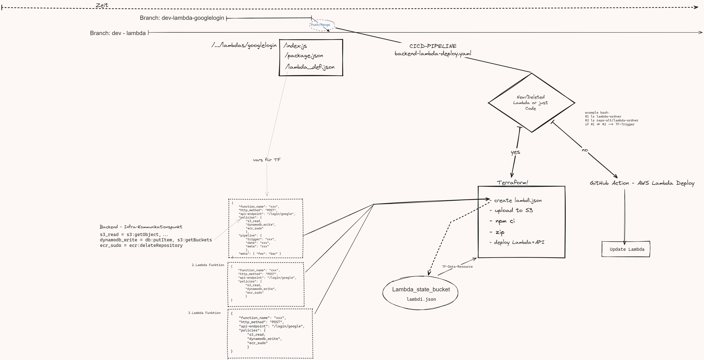

# Lambda Workflow
#### Konzept
1. Eine NodeJS-App wird lokal & mit allen gewollten npm-packages entwickelt und getestet.
2. Die App wird in einen [Lambda-Handler](#umwandeln-der-node-app-in-eine-lambda-funktion) verpackt und die Variablen an das Event angepasst.
3. VOR dem push/pull-request wird für die CI/CD die [lambda_def.json](#ausfüllen-der-lambda_defjson) ausgefüllt.
4. Der Code wird auf den dev-Branch gepusht und automatisiert über AWS-Lambda und API-GW bereit gestellt.

------
## Ablauf
#### Entwicklung einer NodeJS-App
1. Kopiere das Verzeichnis [lambda-entwicklung-beispiel](./lambda-entwicklung-beispiel) in dein Projekt.
2. Installiere die benötigten Abhängigkeiten über `npm install`.
3. Füge die erwarteten Variablen/Parameter/Werte in das **apiEvent**-Objekt ein.
4. Entwickle deine Lambda-Funktion in der `index.js`.
```javascript
const apiEvent = {
    "version": "2.0",
    "routeKey": "POST /example/path",
    "queryStringParameters": {
        "provider": "google",
        "token": "", 
        "name": "Json Yaml",
        "email": "json.yaml@datanerd.io",
        "google_id": "90097315",
        "profilbild": "http://link.to/profilepicture"
    }
};
const { Sequelize } = require('sequelize');
const sequelize = new Sequelize("db","user","passwd");

(async () => {
    try {
        await sequelize.authenticate();
        console.log('Connection has been established successfully.');

        // ########## Füge Nutzer Hinzu
        const ed = apiEvent.queryStringParameters;
        const [results, metadata] = await sequelize.query(`INSERT INTO Nutzer (Name, Email, Google_id, Profilbild) VALUES ('${ ed.name }', '${ ed.email }', '${ ed.google_id }', '${ ed.profilbild }')`);

        console.log(results);
    } catch (error) {
        console.error('Unable to connect to the database:', error);
    }
})();
```

5. Teste deine Lambda-Funktion lokal mit `node index.js`.

------
#### Umwandeln der Node-App in eine Lambda-Funktion
1. Lösche das apiEvent-Objekt.
2. Verpacke die Lambda-Funktion in den Lambda-Handler.
3. Schreibe die HTTP-Response für die verschiedenen Fälle.

```javascript
const { Sequelize } = require('sequelize');
// ##### Sequelize - Package
const sequelize = new Sequelize("db","user","passwd");

exports.handler = async (event) => {
    (async () => {
        try {
            await sequelize.authenticate();
            console.log('Connection has been established successfully.');
            // ########## Füge Nutzer Hinzu
            const [results, metadata] = await sequelize.query(`INSERT INTO Nutzer (Name, Email, Google_id, Profilbild) VALUES ('${ ed.name }', '${ ed.email }', '${ ed.google_id }', '${ ed.profilbild }')`);


            console.log(results);
        } catch (error) {
            console.error('Unable to connect to the database:', error);
        }
    })();
    if (res.email) {
        // ALLES SUPER, wir haben die Infos nach Schema
        console.log("GOOGLE-SUCCESS: " + JSON.stringify(res));
        response = {
            statusCode: 200,
            body: JSON.stringify({
                email: res.email,
            })
        };
    }
    else {
        // FAIL, Auth-Prozess gescheitert
        console.log("GOOGLE-ERROR: " + JSON.stringify(res));
        response = {
            statusCode: 401,
            body: JSON.stringify({
                message: "Error while Authenticating. Please retry.",
            })
        };
    }

    return response;
};
```

------
#### Ausfüllen der lambda_def.json
```json
{
    "function_name": "xxx",
    "http_method": "POST",
    "api-endpoint": "/login/google",
    "policies": {
        "s3": "read",
        "dynamodb": "write",
        "ecr": "sudo"
    },
    "pipeline": {
        "trigger": "xxx",
        "date": "xxx",
        "meta": "xxx"
        },
    "meta": { 
        "foo": "bar",
        "tags": {
            "environment": "dev",
            "deploy": "terraform"
            } 
        }
}
```

------
#### Push/Pull to CI/CD

- [https://docs.github.com/en/actions/using-workflows/caching-dependencies-to-speed-up-workflows](caching deps)
- [https://docs.github.com/en/actions/using-workflows/storing-workflow-data-as-artifacts](storing artifacts)